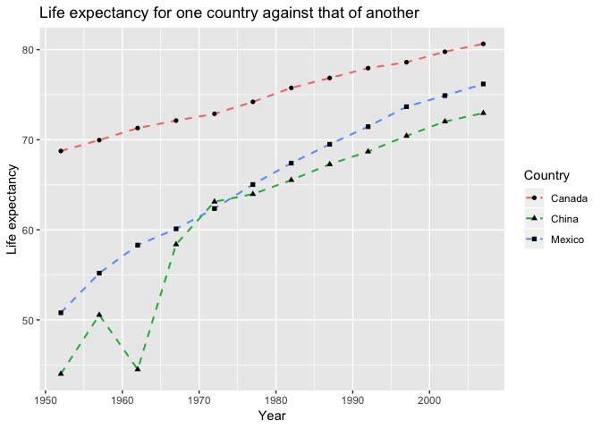
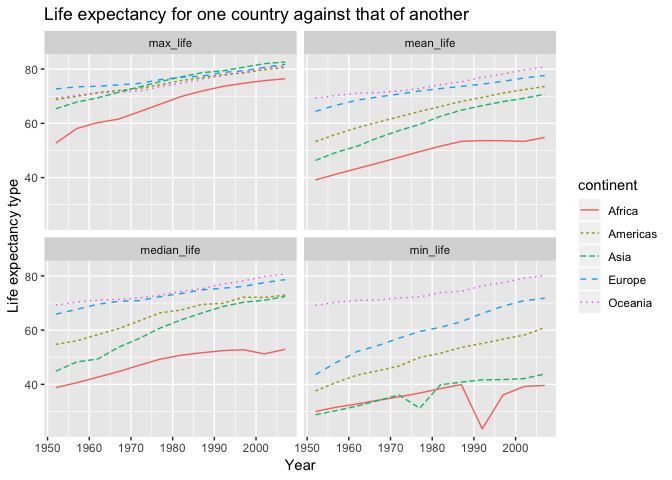

hw04
================
ziqiangt
2018/10/7

Overview
--------

The goal of this homework is to solidify my data wrangling skills by working some realistic problems in the grey area between data aggregation and data reshaping.

The Assignment
--------------

This is a “choose your own adventure”-style assignment, where you are expected to do the following two things:

1.  Pick one of the data reshaping prompts and do it.
2.  Pick one of the join prompts and do it. It is fine to work with a new dataset and/or create variations on these problem themes.

let's first library all dataset:

``` r
library(tibble)
library(tidyverse)
```

    ## -- Attaching packages --------------------------------------- tidyverse 1.2.1 --

    ## <U+221A> ggplot2 3.0.0     <U+221A> purrr   0.2.5
    ## <U+221A> tidyr   0.8.1     <U+221A> dplyr   0.7.6
    ## <U+221A> readr   1.1.1     <U+221A> stringr 1.3.1
    ## <U+221A> ggplot2 3.0.0     <U+221A> forcats 0.3.0

    ## -- Conflicts ------------------------------------------ tidyverse_conflicts() --
    ## x dplyr::filter() masks stats::filter()
    ## x dplyr::lag()    masks stats::lag()

``` r
library(gapminder)
library(ggplot2)
library(knitr)
```

Data Reshaping Prompts (and relationship to aggregation)
--------------------------------------------------------

#### Activity \#2

-   Make a tibble with one row per year and columns for life expectancy for two or more countries.
    -   Use `knitr::kable()` to make this table look pretty in your rendered homework.
    -   Take advantage of this new data shape to scatterplot life expectancy for one country against that of another.

``` r
## Let's extract the life expectancy for these three country from gapminder
untidy_ver <- gapminder %>% 
  filter( country == "China" | country == "Canada" | country == "Mexico") %>% 
  select( year, country, lifeExp) 

## View the dadaset
## just see the first 10 rows
kable(head( untidy_ver, 10 ))
```

|  year| country |  lifeExp|
|-----:|:--------|--------:|
|  1952| Canada  |    68.75|
|  1957| Canada  |    69.96|
|  1962| Canada  |    71.30|
|  1967| Canada  |    72.13|
|  1972| Canada  |    72.88|
|  1977| Canada  |    74.21|
|  1982| Canada  |    75.76|
|  1987| Canada  |    76.86|
|  1992| Canada  |    77.95|
|  1997| Canada  |    78.61|

It can seen that the data set is untidy now. With the following two functions, we can make data tidy. Here is the cheatsheet:

| tidyr Function | Definition                                                 |
|----------------|------------------------------------------------------------|
| `spread`       | Spread a key-value pair across multiple columns            |
| `gather`       | takes multiple columns and collapses into key values pairs |

Let's first spread the data by country.

``` r
## let's spread the data by country
tidy_ver <- gapminder %>% 
  filter( country == "China" | country == "Canada" | country == "Mexico") %>% 
  select( year, country, lifeExp) %>% 
  spread( key = country, value = lifeExp)

## View the dadaset
tidy_ver %>% 
  kable()
```

|  year|  Canada|     China|  Mexico|
|-----:|-------:|---------:|-------:|
|  1952|  68.750|  44.00000|  50.789|
|  1957|  69.960|  50.54896|  55.190|
|  1962|  71.300|  44.50136|  58.299|
|  1967|  72.130|  58.38112|  60.110|
|  1972|  72.880|  63.11888|  62.361|
|  1977|  74.210|  63.96736|  65.032|
|  1982|  75.760|  65.52500|  67.405|
|  1987|  76.860|  67.27400|  69.498|
|  1992|  77.950|  68.69000|  71.455|
|  1997|  78.610|  70.42600|  73.670|
|  2002|  79.770|  72.02800|  74.902|
|  2007|  80.653|  72.96100|  76.195|

It can seen the data has been sperated by the country. Now, let's veiw the scatter plot of the data using gather.

``` r
## Actually, we can directly use untidy dataset with group function. However, I insist to gather function here just for learning.

tidy_ver %>% 
  ## gather the col 2 and 4 data_set
  gather( key = Country,  value = three_country, 2:4 ) %>%  
  ## plot the data with color fill
  ggplot( aes( x = year, y = three_country, color = Country )) +
  geom_line(linetype = "dashed", size = 0.7) +
  geom_point(aes(shape = Country), color = "black") +
  ## title
  ggtitle( "Life expectancy for one country against that of another" ) +
  xlab( "Year") +
  ylab( "Life expectancy" )
```



Conclusion for Activity \#2, The function spread and gather are used to spearate and gather the dataset. It can be seen that the trend of fife expectancy for one country against that of another.

#### Activity \#3

-   Compute some measure of life expectancy (mean? median? min? max?) for all possible combinations of continent and year. Reshape that to have one row per year and one variable for each continent. Or the other way around: one row per continent and one variable per year.
    -   Use `knitr::kable()` to make this table look pretty in your rendered homework.
    -   Is there a plot that is easier to make with the data in this shape versis the usual form? If so (or you think so), try it! Reflect.

let's first look at the life expectancy for combinations of continent and year

``` r
## let's viw the mean, median, min and max
Untidy_life <- gapminder %>%   
  group_by( year, continent ) %>% 
  summarise( mean_life = mean( lifeExp ),
            median_life = median( lifeExp ),
            max_life = max( lifeExp ),
            min_life = min( lifeExp ))

## just see the first 10 rows
kable(head( Untidy_life, 10 ))
```

|  year| continent |  mean\_life|  median\_life|  max\_life|  min\_life|
|-----:|:----------|-----------:|-------------:|----------:|----------:|
|  1952| Africa    |    39.13550|       38.8330|     52.724|     30.000|
|  1952| Americas  |    53.27984|       54.7450|     68.750|     37.579|
|  1952| Asia      |    46.31439|       44.8690|     65.390|     28.801|
|  1952| Europe    |    64.40850|       65.9000|     72.670|     43.585|
|  1952| Oceania   |    69.25500|       69.2550|     69.390|     69.120|
|  1957| Africa    |    41.26635|       40.5925|     58.089|     31.570|
|  1957| Americas  |    55.96028|       56.0740|     69.960|     40.696|
|  1957| Asia      |    49.31854|       48.2840|     67.840|     30.332|
|  1957| Europe    |    66.70307|       67.6500|     73.470|     48.079|
|  1957| Oceania   |    70.29500|       70.2950|     70.330|     70.260|

Let's try to do some reshape using gather and spread.

``` r
Reshape_life <- Untidy_life %>% 
  ## Let's gather the life_exp combinations
  gather( key = Life_comb,  value = combinations, 3:6 ) %>% 
  ## spread the continent
  spread( key = continent,  value = combinations)

## just see the first 10 rows
kable(head( Reshape_life, 10 ))
```

|  year| Life\_comb   |    Africa|  Americas|      Asia|    Europe|  Oceania|
|-----:|:-------------|---------:|---------:|---------:|---------:|--------:|
|  1952| max\_life    |  52.72400|  68.75000|  65.39000|  72.67000|   69.390|
|  1952| mean\_life   |  39.13550|  53.27984|  46.31439|  64.40850|   69.255|
|  1952| median\_life |  38.83300|  54.74500|  44.86900|  65.90000|   69.255|
|  1952| min\_life    |  30.00000|  37.57900|  28.80100|  43.58500|   69.120|
|  1957| max\_life    |  58.08900|  69.96000|  67.84000|  73.47000|   70.330|
|  1957| mean\_life   |  41.26635|  55.96028|  49.31854|  66.70307|   70.295|
|  1957| median\_life |  40.59250|  56.07400|  48.28400|  67.65000|   70.295|
|  1957| min\_life    |  31.57000|  40.69600|  30.33200|  48.07900|   70.260|
|  1962| max\_life    |  60.24600|  71.30000|  69.39000|  73.68000|   71.240|
|  1962| mean\_life   |  43.31944|  58.39876|  51.56322|  68.53923|   71.085|

We can also make year be each coloum.

``` r
Reshape_life_2 <- Untidy_life %>% 
  ## Let's gather the life_exp combinations
  gather( key = Life_comb,  value = combinations, 3:6 ) %>% 
  ## spread the continent
  spread( key = year,  value = combinations)

## just see the first 10 rows
kable(head( Reshape_life_2, 10 ))
```

| continent | Life\_comb   |      1952|      1957|      1962|      1967|      1972|      1977|      1982|      1987|      1992|      1997|      2002|      2007|
|:----------|:-------------|---------:|---------:|---------:|---------:|---------:|---------:|---------:|---------:|---------:|---------:|---------:|---------:|
| Africa    | max\_life    |  52.72400|  58.08900|  60.24600|  61.55700|  64.27400|  67.06400|  69.88500|  71.91300|  73.61500|  74.77200|  75.74400|  76.44200|
| Africa    | mean\_life   |  39.13550|  41.26635|  43.31944|  45.33454|  47.45094|  49.58042|  51.59287|  53.34479|  53.62958|  53.59827|  53.32523|  54.80604|
| Africa    | median\_life |  38.83300|  40.59250|  42.63050|  44.69850|  47.03150|  49.27250|  50.75600|  51.63950|  52.42900|  52.75900|  51.23550|  52.92650|
| Africa    | min\_life    |  30.00000|  31.57000|  32.76700|  34.11300|  35.40000|  36.78800|  38.44500|  39.90600|  23.59900|  36.08700|  39.19300|  39.61300|
| Americas  | max\_life    |  68.75000|  69.96000|  71.30000|  72.13000|  72.88000|  74.21000|  75.76000|  76.86000|  77.95000|  78.61000|  79.77000|  80.65300|
| Americas  | mean\_life   |  53.27984|  55.96028|  58.39876|  60.41092|  62.39492|  64.39156|  66.22884|  68.09072|  69.56836|  71.15048|  72.42204|  73.60812|
| Americas  | median\_life |  54.74500|  56.07400|  58.29900|  60.52300|  63.44100|  66.35300|  67.40500|  69.49800|  69.86200|  72.14600|  72.04700|  72.89900|
| Americas  | min\_life    |  37.57900|  40.69600|  43.42800|  45.03200|  46.71400|  49.92300|  51.46100|  53.63600|  55.08900|  56.67100|  58.13700|  60.91600|
| Asia      | max\_life    |  65.39000|  67.84000|  69.39000|  71.43000|  73.42000|  75.38000|  77.11000|  78.67000|  79.36000|  80.69000|  82.00000|  82.60300|
| Asia      | mean\_life   |  46.31439|  49.31854|  51.56322|  54.66364|  57.31927|  59.61056|  62.61794|  64.85118|  66.53721|  68.02052|  69.23388|  70.72848|

We can use facet\_wrap function with all combinations.

``` r
Untidy_life %>% 
  ## Let's gather the life_exp combinations for the future facet_wrap
  gather( key = Life_comb,  value = combinations, 3:6 ) %>% 
  ## plot the data with color fill
  ggplot( aes( x = year, y = combinations, color = continent )) +
  geom_line(aes(linetype = continent)) +
  facet_wrap( .~Life_comb )  +
  ## title
  ggtitle( "Life expectancy for one country against that of another" ) +
  xlab( "Year") +
  ylab( "Life expectancy type" )
```



From above figure, it can be seen that the Africa seems has lowest life\_exp in all combinations. In the Activity \#3, we further learned how to use gather and spread functions.

#### Activity \#4

-   In Window functions, we formed a tibble with 24 rows: 2 per year, giving the country with both the lowest and highest life expectancy (in Asia). Take that table (or a similar one for all continents) and reshape it so you have one row per year or per year \* continent combination.

``` r
Window_life <- gapminder %>%
  group_by( year, continent) %>% 
  filter( min_rank( lifeExp) < 2 | min_rank( desc( lifeExp)) < 2) %>%
  select( year, continent, country, lifeExp) 
  
## just see the first 10 rows
kable( head( Window_life, 10))
```

|  year| continent | country     |  lifeExp|
|-----:|:----------|:------------|--------:|
|  1952| Asia      | Afghanistan |   28.801|
|  1957| Asia      | Afghanistan |   30.332|
|  1962| Asia      | Afghanistan |   31.997|
|  1967| Asia      | Afghanistan |   34.020|
|  1972| Asia      | Afghanistan |   36.088|
|  1982| Asia      | Afghanistan |   39.854|
|  1987| Asia      | Afghanistan |   40.822|
|  1992| Asia      | Afghanistan |   41.674|
|  1997| Asia      | Afghanistan |   41.763|
|  2002| Asia      | Afghanistan |   42.129|

Let's reshape the above table to have per year \* continent combination.

``` r
Reshape_Window_life <- Window_life %>% 
  spread(key = continent, value = lifeExp)

## just see the first 10 rows
kable( head( Reshape_Window_life, 10))
```

|  year| country     |  Africa|  Americas|    Asia|  Europe|  Oceania|
|-----:|:------------|-------:|---------:|-------:|-------:|--------:|
|  1952| Afghanistan |      NA|        NA|  28.801|      NA|       NA|
|  1952| Australia   |      NA|        NA|      NA|      NA|    69.12|
|  1952| Canada      |      NA|    68.750|      NA|      NA|       NA|
|  1952| Gambia      |  30.000|        NA|      NA|      NA|       NA|
|  1952| Haiti       |      NA|    37.579|      NA|      NA|       NA|
|  1952| Israel      |      NA|        NA|  65.390|      NA|       NA|
|  1952| New Zealand |      NA|        NA|      NA|      NA|    69.39|
|  1952| Norway      |      NA|        NA|      NA|  72.670|       NA|
|  1952| Reunion     |  52.724|        NA|      NA|      NA|       NA|
|  1952| Turkey      |      NA|        NA|      NA|  43.585|       NA|
